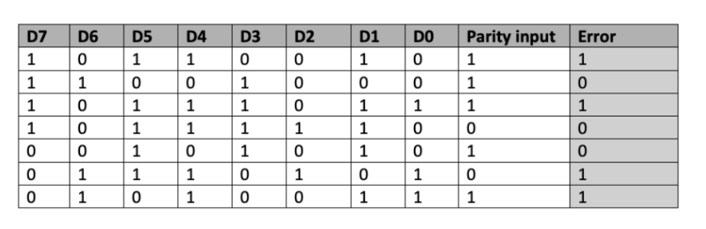
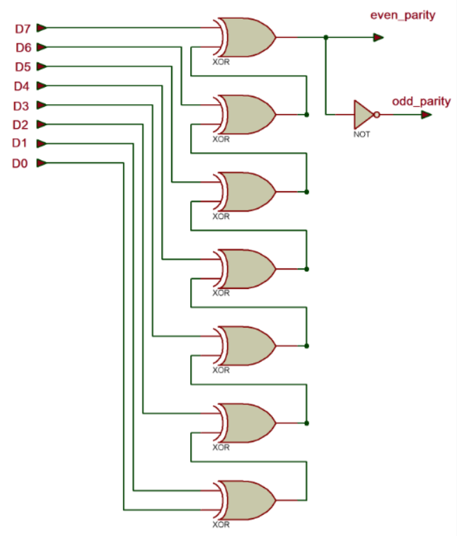
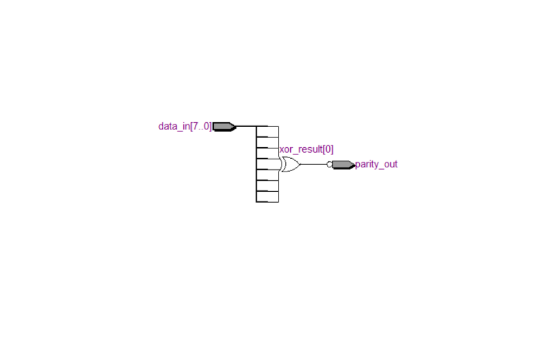
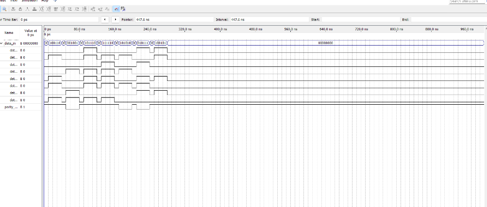

# 8 BIT PARITY GENERATOR USING VERILOG


## AIM:

Design and generate 8 bit parity generator using Verilog.

## EQUIPMENTS REQUIRED

Hardware – PCs, Cyclone II , USB flasher

Software – Quartus prime

## THEORY

Parity Generator

An 8-bit parity generator is a digital circuit that generates a parity bit based on a set of 8 input data bits. The purpose of the parity bit is to provide error detection in data transmission or storage systems.The parity bit is calculated based on the number of 1s in the input data bits. There are two types of parity: even parity and odd parity.In even parity, the parity bit is set to 1 if the number of 1s in the input data is odd. This ensures that the total number of 1s, including the parity bit, is always even.In odd parity, the parity bit is set to 1 if the number of 1s in the input data is even. This ensures that the total number of 1s, including the parity bit, is always odd.


## TRUTH TABLE




## LOGIC DIAGRAM




## NETLIST DIAGRAM



## TIMING DIAGRAM



## PROGRAM
Program to simulate 8 bit parity generator using Verilog.
 
NAME : NITEESH M
 
REG.NO : 212222230098
````
module parity_generator (
       input [7:0] data_in,
       output reg parity_out
   );

 always @(*) 
        begin
           reg [7:0] xor_result;
  
          xor_result = data_in[0] ^ data_in[1] ^ data_in[2] ^ data_in[3] ^ data_in[4] ^ data_in[5] ^ data_in[6] ^ data_in[7];
           parity_out= ~xor_result;
             end

    endmodule
````

# RESULT
Thus the synchronous 8 bit parity generator has been implemented in Quartus Prime and output is verified by using Verilog programming through its truth table
